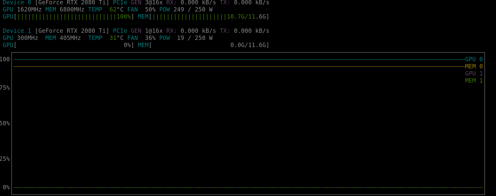

# CTNet


<p align="center">
  <a href="#code-structure">Code</a> •
  <a href="#how-to">How To Use</a> •
  <a href="#docker">Docker </a> •
</p>


### Code structure
```python
from setuptools import setup
from ctnet import __version__

setup(
    name='ctnet',
    version=__version__,
    long_description="ctnet",
    packages=[
        "ctnet",
        "ctnet.infer",
        "ctnet.modules",
        "ctnet.trainer",
    ],
    include_package_data=True,
    url='https://github.com/JeanMaximilienCadic/ctnet',
    license='MIT',
    author='Jean Maximilien Cadic',
    python_requires='>=3.6',
    install_requires=[d.rsplit()[0] for d in open("requirements.txt").readlines()],
    author_email='support@cadic.jp',
    description='ctnet',
    classifiers=[
        "Programming Language :: Python :: 3.6",
        "License :: OSI Approved :: MIT License",
    ]
)
```

The main execution:
```python
from ctnet.modules import CTNet
from torch.optim import Adam
from ai3d.data.dataset import CTDataset
from torch.utils.data import DataLoader
import os
from torchsummary import summary
from ctnet.trainer import CTNetTrainer
import argparse

if __name__ == "__main__":


    parser = argparse.ArgumentParser(description='Process some integers.')
    # ##########################################  PATH RELATED #########################################################
    parser.add_argument('train_ply_folder')
    parser.add_argument('dev_ply_folder')
    ################################################ HP ################################################################
    parser.add_argument('--dim', default=64, type=int)
    parser.add_argument('--bs', default=100, type=int)
    parser.add_argument('--strech_box', action="store_true")
    parser.add_argument('--lr', default=pow(10, -3), type=float)
    parser.add_argument('--no_shuffle', action="store_true")
    parser.add_argument('--epochs', default=1000, type=int)
    parser.add_argument('--epoch', default=0, type=int)
    parser.add_argument('--num_workers', default=1, type=int)

    args = parser.parse_args()

    # Model
    ctnet = CTNet(args.dim, id=f"ctnet{args.dim}_dense_streched_{args.strech_box}").cuda()
    model_path = os.path.realpath(f"__data__/models/{ctnet.id}/{ctnet.id}.pth")
    ckpt_model_path = model_path.replace(".pth", ".ckpt.pth")

    # Summary
    summary(ctnet, (args.dim, args.dim, args.dim), batch_size=args.bs)

    # Loader
    train_dataset = CTDataset(ply_folder=args.train_ply_folder, dim=args.dim)
    dev_dataset = CTDataset(ply_folder=args.dev_ply_folder, dim=args.dim)
    # Model variables
    (train_loader, dev_loader) = tuple([DataLoader(dataset=dataset,
                                                   batch_size=args.bs,
                                                   num_workers=args.num_workers,
                                                   shuffle=not args.no_shuffle,
                                                   drop_last=True
                                                   )
                                        for dataset in [train_dataset, dev_dataset]])

    trainer = CTNetTrainer(
        model=ctnet,
        optimizer=Adam,
        optimizer_kwargs={"lr": args.lr},
        epoch=args.epoch,
        continue_from=model_path,
        train_loader=train_loader,
        dev_loader=dev_loader,
        model_path=model_path,
        checkpoint_path=ckpt_model_path,
        shuffle=not args.no_shuffle)

    trainer.run(epochs=args.epochs)


```
### How to

```bash
# Clone this repository and install the code
$ https://github.com/JeanMaximilienCadic/ctnet

# Go into the repository
$ cd ctnet

# Install with python (not recommended)
$ python setup.py install
```
### Docker
```
docker run --gpus all --rm  -v $(pwd):$(pwd) -p 8888:8888 -it tensorflow/tensorflow:latest-gpu-jupyter sh
```

Run a test:
```python
python -m ctnet.trainer
```
